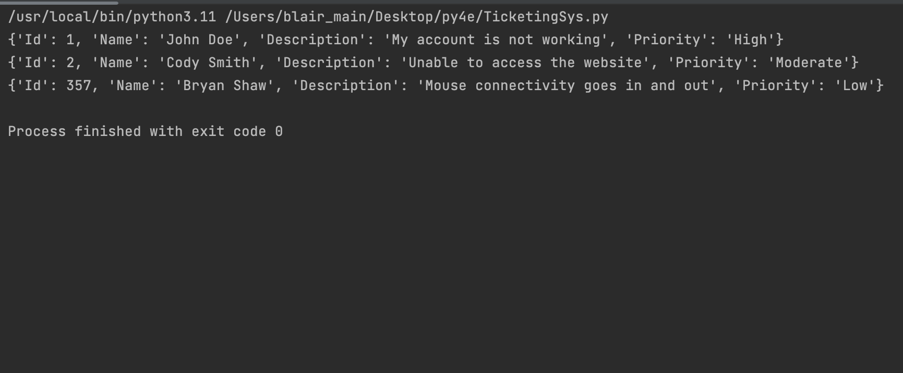

<h1>Ticketing System Program</h1>

<h2>Description</h2>
Ticketing Systems are used by companies mainly as a time management tool. These systems frequently include an ID number, sender or client information ( ex. Name and email) and a description. I used python to program a simple ticketing system with the following parameters: <hh6> <i>Ticketing_id , Name , Description , Priority</i></h6>
<h2>Languages and Utilities Used</h2>

- <b>Python3</b> 
- <b>PyCharm</b>

<h2>Environments Used </h2>

- <b>macOS</b>

<h2>Program walk-through:</h2>

Define the parameters (as mentioned above) to create the "add_ticket function":  

 
 
Define the "view_ticket function" by using the 'Id' parameter while also using the "add_ticket function" to create the ticket entries :  

 
 
Final Output:  

 
 

